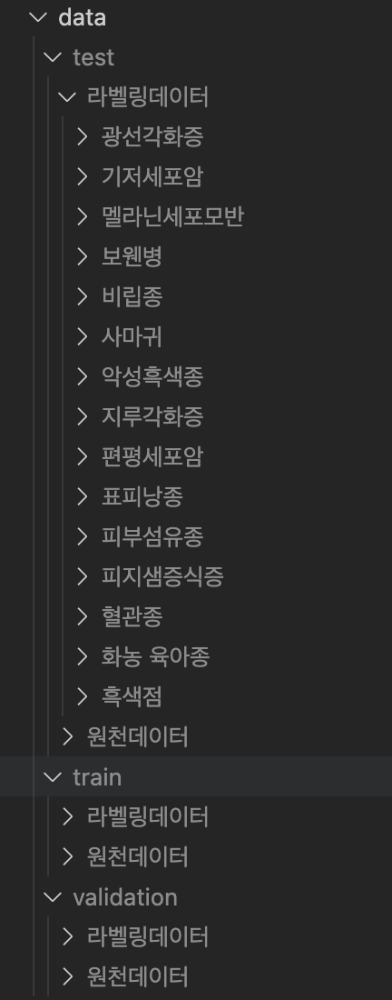

# SNU_2025_Deeplearning_project
SNU 빅데이터 핀테크 AI 과정 - 딥러닝 팀 프로젝트 레포지토리


## 프로젝트 구성
```bash
│               
├── common/
│   ├── config.py
│   ├── dataset.py
│   ├── evaluate.py
│   ├── logger.py
│   └── utils.py
│
├── data/
│   ├── test/
│   ├── train/
│   └── validation/
│
├── logs/
│   ├── confusion_matrix.png
│   ├── train_log.json
│   └── train_logs/
│       
├── model/
│   ├── best_convnet_model.pth
│   ├── best_resnet_model.pth
│   └── best_vit_model.pth
│
├── normalize_data.py
├── generate_test_labels.py
├── 01_ResNet.ipynb
├── 02_Vit.ipynb
├── 03_ConvNet.ipynb
├── 04_SwinTransformer.ipynb
│
├── README.md
└── .gitignore

```

## 각 폴더, 파일 설명
- common/ : 공통으로 사용되는 python 모듈들
  - config.py : 모델링에 필요한 config 변수, 파라미터들 모았 놓음. 해당 파일에서 파라미터 값을 수정하면서 각 모델 훈련을 진행하면 됨!
- data/ : 모델링, 검증에 사용되는 데이터 파일들
- logs/ : 모델링, 검증에서 출력되는 log, 이미지 파일들
- model/ : 각 모델별 best 성능 모델 파일
- normalize_data.py : data/ 폴더 내 test/validation/train 폴더명 정규화 스크립트
- generate_test_labels.py : test 데이터 셋의 라벨링 데이터가 없는 경우, 이미지 명을 기반으로 자동 생성되도록 해주는 스크립트

## data/ 구조 관련
- 아래 이미지 처럼 기본 구조를 맞추고, 폴더명은 normalize_data.py를 돌리면 자동으로 폴더명 정리가 진행됨!
  
