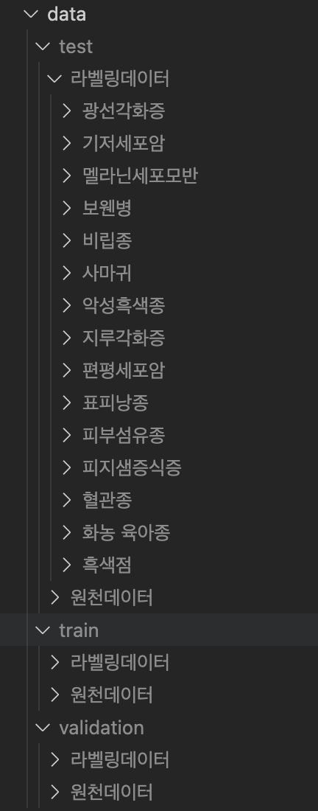

# SNU_2025_Deeplearning_project

서울대학교 **빅데이터 핀테크 AI 과정** 딥러닝 팀 프로젝트 레포지토리입니다.

## 프로젝트 개요

### 목표

피부 임상 이미지를 **15개 진단 클래스**로 분류하는 **의료 영상 다중 분류** 과제를 수행합니다. 단일 분류 모델 실험뿐 아니라, **MobileSAM**으로 병변 영역(ROI)을 추출·크롭한 뒤 분류 성능을 비교할 수 있는 **세그멘테이션 선행 파이프라인**까지 포함합니다.

### 15개 클래스

| 인덱스 | 클래스명 |
|--------|----------|
| 0 | 광선각화증 |
| 1 | 기저세포암 |
| 2 | 멜라닌세포모반 |
| 3 | 보웬병 |
| 4 | 비립종 |
| 5 | 사마귀 |
| 6 | 악성흑색종 |
| 7 | 지루각화증 |
| 8 | 편평세포암 |
| 9 | 표피낭종 |
| 10 | 피부섬유종 |
| 11 | 피지샘증식증 |
| 12 | 혈관종 |
| 13 | 화농 육아종 |
| 14 | 흑색점 |

클래스 정의는 `common/config.py`의 `CLASS_NAMES` 및 `common/dataset.py`의 `diagnosis_to_label`과 일치해야 합니다.

### 비교·실험 모델

- **Baseline ResNet** — `00_Baseline_ResNet.ipynb`, `train_resnet_baseline.py`
- **ResNet** — `01_ResNet.ipynb`
- **Vision Transformer (ViT)** — `02_Vit.ipynb`, `train_vit_baseline.py`
- **ConvNet** — `03_ConvNet.ipynb`
- **Swin Transformer V2-T** — `04_SwinTransformer.ipynb`

학습이 완료된 가중치는 `model/` 디렉터리에 저장됩니다 (예: `best_resnet_model.pth`, `best_vit_model.pth`, `mobile_sam.pt` 등).

---

## 기술 스택

| 영역 | 사용 기술 |
|------|-----------|
| 딥러닝 | PyTorch, torchvision |
| 세그멘테이션 | Ultralytics SAM (MobileSAM), 선택적 YOLO |
| 데이터·지표 | scikit-learn, NumPy, SciPy (`ndimage`) |
| 영상 I/O·전처리 | Pillow (PIL), OpenCV (스크립트 일부) |
| 시각화 | matplotlib, seaborn |
| 기타 | tqdm, Jupyter |

> 별도 `requirements.txt`는 없습니다. 위 패키지를 Python 3 환경에 설치한 뒤 사용하세요. GPU는 **CUDA**, Apple Silicon은 **MPS**, 그 외 **CPU**를 자동으로 사용합니다 (`common/config.py`의 `DEVICE`).

---

## 저장소 구조

```text
├── common/                          # 공통 모듈
│   ├── config.py                    # 경로, 하이퍼파라미터, 변환, 클래스명, 디바이스
│   ├── dataset.py                   # JSON 라벨 기반 CustomDataset
│   ├── evaluate.py                  # 테스트 평가, 혼동행렬 저장
│   ├── logger.py                    # JSON 로깅
│   ├── utils.py                     # 시드, F1/AUROC/Top-k, 체크포인트, 경로 정규화
│   └── segmentation.py            # MobileSAM 파이프라인 (마스크·ROI·후처리)
│
├── data/                            # 데이터 (git에 포함 여부는 .gitignore 따름)
│   ├── train/                       # 원천데이터, 라벨링데이터
│   ├── validation/
│   ├── test/
│   ├── new_test/
│   ├── segmented_test/ 등           # 세그멘테이션 결과·실험용 split
│   └── ...
│
├── logs/                            # 학습·테스트 로그, 혼동행렬 이미지
├── model/                           # 베스트 가중치, mobile_sam.pt
│
├── scripts/                         # 세그멘테이션 일괄 처리 등 (상세: scripts/README.md)
│   ├── run_complete_pipeline.py
│   ├── integrated_segmentation_pipeline.py
│   ├── organize_segmented_data.py
│   └── strip_processed_suffix.py
│
├── normalize_data.py                # data/ 하위 split·한글 폴더명 정규화
├── generate_test_labels.py          # 테스트용 라벨 JSON 자동 생성 (파일명 규칙 기반)
├── train_resnet_baseline.py
├── train_vit_baseline.py
├── auroc_visualization.ipynb
│
├── 00_Baseline_ResNet.ipynb
├── 01_ResNet.ipynb
├── 02_Vit.ipynb
├── 03_ConvNet.ipynb
├── 04_SwinTransformer.ipynb
│
├── README.md
├── scripts/README.md
├── data_model_structure.png
└── .gitignore
```

---

## `common/` 모듈 설명

| 파일 | 역할 |
|------|------|
| **config.py** | `TRAIN_*` / `VAL_*` / `TEST_*` 경로, `NUM_CLASSES`, `IMG_SIZE`, 배치·에폭·LR·weight decay·warmup·dropout, ImageNet mean/std, `TRAIN_TRANSFORM` / `VAL_TRANSFORM`, 디바이스(CUDA/MPS/CPU), 한글 폰트 설정 |
| **dataset.py** | 라벨 폴더를 재귀 탐색해 JSON의 `annotations`에서 진단명·identifier·이미지 경로를 읽고, 확장자 불일치 시 스템 기준으로 `.jpg`/`.png` 등 탐색 후 RGB 로드 |
| **evaluate.py** | `evaluate_test_set`: 손실, Top-1/Top-3 정확도, Macro F1, Macro AUROC, 예측 수집 후 `print_test_results`로 출력 및 혼동행렬 PNG 저장 |
| **utils.py** | `set_seed`, `calculate_f1_score`, `calculate_auroc` (OvR 평균), `calculate_top_k_accuracy`, 체크포인트 저장, 데이터 경로 문자열 정규화(`normalize_dataset_path`) |
| **logger.py** | 에폭별 메트릭 등을 JSON 배열로 누적 저장 |
| **segmentation.py** | `SegmentationPipeline`: MobileSAM 추론, 선택적 YOLO 박스 프롬프트, 다중 포인트 프롬프트, 마스크 후처리(형태학, 최대 연결요소, hole fill), Otsu 폴백, 정사각 ROI 크롭 후 224×224 리사이즈 |

---

## 데이터 준비

### 권장 디렉터리 구조

학습·검증은 **원천데이터**(이미지)와 **라벨링데이터**(JSON)가 split별로 구분된 형태를 가정합니다. 아래 이미지와 같이 맞춘 뒤, 폴더명이 제각각이면 `normalize_data.py`로 정리할 수 있습니다.



### 정규화 스크립트

- **`normalize_data.py`**: `data/` 아래 `train`, `validation`, `test` 등 split 폴더명과 `원천데이터` / `라벨링데이터` 표기 통일
- **`common/utils.py`의 `normalize_dataset_path`**: 경로 문자열 내 `training`/`Train` → 통일, `01. 원천데이터` 등 → `원천데이터` 형태로 정규화

### 테스트 라벨이 없을 때

- **`generate_test_labels.py`**: 이미지 파일명 규칙을 이용해 라벨링 JSON을 생성 (상세는 스크립트 주석·구현 참고)

### JSON 어노테이션 (dataset 기준)

- `annotations[].diagnosis_info.diagnosis_name` → 위 15개 클래스명과 매핑
- `annotations[].identifier`
- `annotations[].bbox.file_path` → `원천데이터` 루트 기준 상대 경로 (실제 파일 확장자와 다를 수 있어 `dataset.py`에서 보완 탐색)

---

## 모델 학습·실험

1. **`common/config.py`**에서 배치 크기, 에폭, 학습률, 이미지 크기 등을 조정합니다.
2. **Jupyter 노트북** `00_` ~ `04_` 순서 또는 목적에 맞는 노트북을 열어 셀을 실행합니다. 노트북은 `common` 모듈을 import해 동일한 데이터·평가 흐름을 공유합니다.
3. **스크립트** `train_resnet_baseline.py`, `train_vit_baseline.py`는 폴더 구조 기반 데이터셋으로 학습하는 대안 엔트리포인트입니다.

### 전처리·증강 요약

- **학습**: `RandomResizedCrop`, RandomHorizontalFlip, ColorJitter, Normalize(ImageNet)
- **검증**: Resize → CenterCrop → Normalize
- 입력 해상도 기본 **224×224** (`IMG_SIZE`)

### 평가 지표

- **Top-1 / Top-3** 정확도  
- **Macro F1**  
- **Macro AUROC** (클래스별 One-vs-Rest 후 평균)  
- **혼동 행렬**: `logs/confusion_matrix_<모델명>.png` (한글 클래스 라벨)

---

## 세그멘테이션 파이프라인 (MobileSAM)

배경·전신 컨텍스트 대신 **병변 ROI**에 집중한 입력을 만들기 위해 MobileSAM을 사용합니다.

- **핵심 코드**: `common/segmentation.py` (`SegmentationPipeline`, `PipelineParams`)
- **일괄 실행·CLI**: `scripts/run_complete_pipeline.py`
- **YOLO + SAM 통합 예제**: `scripts/integrated_segmentation_pipeline.py`
- **세그멘테이션 결과를 클래스 폴더로 정리**: `scripts/organize_segmented_data.py`

SAM 가중치는 기본적으로 **`model/mobile_sam.pt`**를 사용합니다. 옵션·워크플로 다이어그램·트러블슈팅은 **[scripts/README.md](./scripts/README.md)**를 참고하세요.

권장 순서 예시:

```bash
# 소량으로 동작 확인
python scripts/run_complete_pipeline.py --max-images 10

# 전체 split 처리 (환경에 맞게 device 지정 가능)
python scripts/run_complete_pipeline.py --device mps

# 클래스별 디렉터리 정리 후, 분류 노트북에서 processed 경로로 재학습
python scripts/organize_segmented_data.py
```

---

## 기타 노트북·스크립트

| 파일 | 설명 |
|------|------|
| **auroc_visualization.ipynb** | AUROC 관련 시각화·분석 |
| **scripts/strip_processed_suffix.py** | 파일명 `_processed` 접미사 제거 유틸 |

---

## 주의사항

- **대용량 데이터·가중치**는 `.gitignore`에 의해 저장소에 없을 수 있습니다. `data/`, `model/`을 별도로 준비해야 합니다.
- 의료 데이터 사용 시 **기관·과정 규정** 및 개인정보 보호 정책을 준수하세요.
- 논문·이력서 등에 성능 수치를 적을 때는 **본인이 재현한 실험**의 `logs/` 또는 노트북 출력값을 인용하는 것이 좋습니다.

---

## 라이선스·출처

교육 과정 팀 프로젝트용 코드입니다. 데이터셋·사전학습 가중치의 재배포 조건은 각각의 원천 라이선스를 따릅니다.
