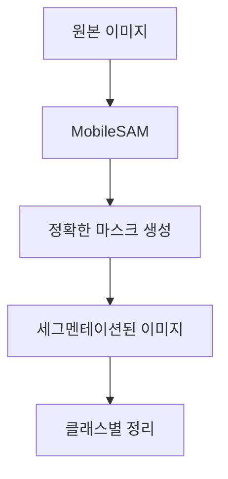

# Segmentation Pipeline Scripts

이 디렉토리는 피부 병변 분류를 위한 세그멘테이션 처리 파이프라인(SAM 중심)을 제공합니다.

## 파일 구조

```
scripts/
├── integrated_segmentation_pipeline.py  # 통합 파이프라인 예제 (YOLO + SAM)
├── run_complete_pipeline.py             # SAM-only 일괄 처리 실행
├── organize_segmented_data.py           # 세그멘테이션 결과를 클래스별로 정리
├── strip_processed_suffix.py            # 파일명에서 _processed 접미사 제거 유틸
└── README.md                            # 이 파일
```

## 전체 워크플로우

### 옵션 1: SAM-only 빠른 파이프라인 (권장)
1. **MobileSAM 사용** → 라벨링 없이 자동 세그멘테이션
2. **일괄 처리 실행** → `run_complete_pipeline.py`로 모든 split 처리
3. **클래스별 정리** → `organize_segmented_data.py`로 클래스 폴더 구조로 정리
4. **분류 모델 재학습** → 세그멘테이션된 이미지로 분류 성능 향상

### 옵션 2: YOLO + SAM 통합 파이프라인 (예제용)
1. **YOLO 세그멘테이션 모델 준비**
2. **YOLO + SAM 처리** → `integrated_segmentation_pipeline.py` 사용
3. **분류 모델 재학습**

## 사용법

### 1) SAM-only 전체 파이프라인 실행 (권장)

```bash
# 기본 실행 (train/validation/test/new_test 전체 처리)
python scripts/run_complete_pipeline.py

# 특정 split만 처리
python scripts/run_complete_pipeline.py --splits new_test
python scripts/run_complete_pipeline.py --splits train test
python scripts/run_complete_pipeline.py --splits validation --max-images 50

# 이미지 수/배치 크기 제한으로 빠른 테스트
python scripts/run_complete_pipeline.py --max-images 100
python scripts/run_complete_pipeline.py --batch-size 5

# 실행 디바이스 지정 (mps/cpu/cuda)
python scripts/run_complete_pipeline.py --device mps

# 처리 단계 스킵 (출력만 확인 등)
python scripts/run_complete_pipeline.py --no-process
```

출력은 각 split별로 다음 위치에 생성됩니다:
- `data/processed_{split}_segmented/images/`
- `data/processed_{split}_segmented/masks/`

### 2) 세그멘테이션 결과를 클래스별 폴더로 정리

```bash
python scripts/organize_segmented_data.py
```

실행 후 다음 구조가 생성됩니다:
- `data/processed_{split}_segmented_organized/images/{클래스명}/...`
- `data/processed_{split}_segmented_organized/masks/{클래스명}/...`

> 참고: `test`, `new_test`는 원본 이미지 폴더 기준으로 클래스 매핑, `train`, `validation`은 라벨 JSON에서 클래스 정보를 추출합니다.

### 3) 통합 파이프라인 (YOLO + SAM) 예제

```python
from scripts.integrated_segmentation_pipeline import IntegratedSegmentationPipeline

pipeline = IntegratedSegmentationPipeline(
    yolo_model_path="runs/segment/lesion_seg/weights/best.pt",
    sam_model_path="./model/mobile_sam.pt"
)

# 단일 이미지 처리
result = pipeline.process_single_image("path/to/image.jpg")

# 전체 데이터셋 처리 (로그 저장 포함)
stats = pipeline.process_dataset(
    input_dir="data/train/원천데이터",
    output_dir="data/processed_train"
)
```

## 입력 데이터 형식

### SAM-only 모드 (권장)
- **이미지**: `data/{train,validation,test,new_test}/원천데이터/{클래스명}/*.jpg`
- **라벨**: 불필요 (SAM이 자동으로 세그멘테이션)
- **클래스**: 15개 피부 병변 클래스

## 출력 데이터

### 처리된 이미지/마스크
- **이미지**: `data/processed_*_segmented/images/{원본명}_processed.jpg`
- **마스크**: `data/processed_*_segmented/masks/{원본명}_mask.png` (0/255)

### 처리 로그
- SAM-only 기본 실행: 표준 출력으로 통계 표시
- 통합 파이프라인 사용 시: `output_dir/processing_log.json`

## 파라미터 조정

### 명령행 옵션 (run_complete_pipeline.py)
```bash
--no-process           # 데이터 처리 스킵
--max-images 100       # 처리할 최대 이미지 수 (split별 상한)
--batch-size 10        # 배치 크기 (일괄 처리 내부 사용)
--device mps           # 디바이스 (mps/cpu/cuda)
--epochs 80            # 예비 옵션 (현재 SAM-only 처리에는 영향 없음)
--splits train test    # 처리할 split 지정 (공백 구분 다중 지정)

# 예시
python scripts/run_complete_pipeline.py --splits new_test --max-images 50 --batch-size 5
```

### SAM 파라미터 (`common/segmentation.py`의 `PipelineParams`)
```python
# 핵심 옵션 (예시)
sam_weights_path="./model/mobile_sam.pt"
yolo_seg_weights_path=None
use_yolo_box_prompt=False
use_multi_point_prompt=True

# 세부 설정
pred_iou_thresh=0.80
stability_score_thresh=0.85
target_size=(224, 224)
```

## 성능/품질 확인

```python
# 처리된 이미지와 마스크 시각화 예시
import cv2
img = cv2.imread("data/processed_train_segmented/images/example_processed.jpg")
mask = cv2.imread("data/processed_train_segmented/masks/example_mask.png", 0)
overlay = img.copy()
overlay[mask > 0] = [0, 255, 0]
result = cv2.addWeighted(img, 0.7, overlay, 0.3, 0)
```

## 문제 해결

1. **모델 파일 없음**: `model/mobile_sam.pt` 존재 확인
2. **메모리 부족**: `--batch-size 5` 또는 `--max-images 50`으로 축소
3. **CUDA 오류**: `--device cpu` 또는 `--device mps` 사용
4. **처리 시간 길어짐**: 먼저 소량(`--max-images`)으로 시험 실행

## 빠른 시작 (권장)

```bash
# 1) 소량으로 동작 확인
python scripts/run_complete_pipeline.py --max-images 10

# 2) 전체 split 처리
python scripts/run_complete_pipeline.py

# 3) 클래스별 정리
python scripts/organize_segmented_data.py
```

